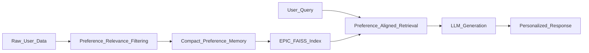

<section id="home" class="home-section hero-section">
  

    <h1>Changmin Lee</h1>
    
AI Research Engineer | MS-PhD Student at <strong>UNIST</strong>

    

      I work on |
    

    

      <a class="btn-link" href="mailto:lchm1106@unist.ac.kr">Email</a>
      <a class="btn-link" href="https://github.com/CkdalsKong" target="_blank" rel="noopener noreferrer">GitHub</a>
      <a class="btn-link" href="https://www.linkedin.com/in/changmin0lee/" target="_blank" rel="noopener noreferrer">LinkedIn</a>
      <a class="btn-link" href="https://arxiv.org/abs/2605.18271" target="_blank" rel="noopener noreferrer">arXiv</a>
      <a class="btn-link" href="/files/CV.pdf">CV</a>
    

  

</section>

<section class="home-section metric-strip" data-animate>
  

    
2,404x

    
less indexing memory (EPIC)

  

  

    
+20.17pp

    
preference-following accuracy

  

  

    
29.35ms

    
query latency on-device

  

</section>

<section id="news" class="home-section" data-animate>
  <h2>News</h2>
  

    

      2026.05
      Our paper <strong>"From Volume to Value: Preference-Aligned Memory Construction for On-Device RAG"</strong> was accepted to <strong>ICML 2026</strong>.
    

    

      2025.08 - 2026.09
      Awarded <strong>NRF Master's Fellowship</strong> (Graduate Student Research Encouragement Grant for Master's Program).
    

  

</section>

<section id="research" class="home-section" data-animate>
  <h2>About & Research</h2>
  

    I am a graduate researcher at UAI Lab, UNIST, advised by Prof. Taesik Gong. I focus on personalized and efficient AI systems that can run under strict memory and latency constraints.
  

  

    Personalized AI
    On-Device RAG
    Efficient LLMs
    Memory Construction
    AI Agents
    Multimodal Systems
  

</section>

<section id="education" class="home-section" data-animate>
  <h2>Education</h2>
  

    

      

        
Ulsan National Institute of Science and Technology (UNIST)

        
M.S.-Ph.D. Integrated Program, Computer Science and Engineering

      

      
Mar. 2025 - Present

    

    
UAI Lab, Advisor: Prof. Taesik Gong

  

  

    

      

        
Kyungpook National University

        
B.S., Computer Science and Engineering

      

      
Mar. 2019 - Feb. 2025

    

    
Total GPA: <strong>3.9/4.3</strong>, Major GPA: <strong>4.2/4.3</strong>

  

</section>

<section id="publications" class="home-section" data-animate>
  <h2>Publications</h2>

  

    ICML 2026
    
From Volume to Value: Preference-Aligned Memory Construction for On-Device RAG

    
<u>Changmin Lee</u>, Jaemin Kim, Taesik Gong

    

      <a class="pub-btn" href="https://arxiv.org/abs/2605.18271" target="_blank" rel="noopener noreferrer">arXiv</a>
      <a class="pub-btn" href="https://github.com/UbiquitousAILab/EPIC" target="_blank" rel="noopener noreferrer">Code</a>
    

    <button class="pub-abstract-toggle" type="button" data-target="abs-epic">Show Abstract</button>
    

      We propose EPIC, a preference-aligned memory construction framework for on-device RAG. Across four benchmarks, EPIC reduces indexing memory by 2,404x, improves preference-following accuracy by 20.17 points, and achieves 33.33x lower retrieval latency over strong baselines.
    

  

  

    IEIE Journal 2024
    
Enhancing Chest X-Ray Classification with Multi-Class Token Hybrid Transformers

    
<u>Chang-min Lee</u>, Ho-kyung Shin, Woo-Jeoung Nam

  

  

    Preprint (Under Preparation)
    
Transition-Level Memory for GUI Agents

    
<u>Changmin Lee</u>, et al.

    
Transition-aware compact memory construction for mobile GUI agents.

  

  

    Korean Multimedia Society 2024 (Poster)
    
Comparison of Recycling Waste Awareness Performance by Transfer Learning Model

    
Dong-hyuk Kim, <u>Chang-min Lee</u>, et al.

  

</section>

<section id="epic-demo" class="home-section" data-animate>
  <h2>EPIC Retrieval Flow</h2>
  

    This is a compact representation of how EPIC transforms raw personal data into preference-aligned memory and serves low-latency retrieval for on-device generation.
  

  

    <h3>Mini Demo (Conceptual)</h3>
    
Type a query and preferred style. The demo shows how a preference-aware memory answer is composed.

    

      <label for="demo-query">Query</label>
      <input id="demo-query" type="text" placeholder="e.g., Recommend a lightweight laptop for research and coding"/>

      <label for="demo-pref">Preference</label>
      <select id="demo-pref">
        <option value="concise">Concise and practical</option>
        <option value="technical">Technical and detailed</option>
        <option value="budget">Budget-first</option>
      </select>
    

    <button class="pub-abstract-toggle demo-run-btn" type="button" id="run-epic-demo">Run Demo</button>
    <pre id="demo-output" class="demo-output">Demo output will appear here.</pre>
  

</section>

<section id="projects" class="home-section" data-animate>
  <h2>Projects (Undergraduate)</h2>
  

    

      <h3>EPIC</h3>
      
Preference-aligned memory construction for efficient on-device RAG under strict resource constraints.

      

        2,404x lower indexing memory, +20.17pp preference-following accuracy, 29.35ms/query on-device latency.
      

      

        RAG
        On-Device AI
        Memory
      

      

        <a class="pub-btn" href="https://arxiv.org/abs/2605.18271" target="_blank" rel="noopener noreferrer">arXiv</a>
        <a class="pub-btn" href="https://github.com/UbiquitousAILab/EPIC" target="_blank" rel="noopener noreferrer">Code</a>
      

    

    

      <h3>Transition-Level Memory for GUI Agents</h3>
      
Compact transition-aware memory design for mobile GUI agents with long-horizon task support.

      

        GUI Agent
        Memory
        Under Preparation
      

    

    

      <h3>MCTCheXFormer</h3>
      
Hybrid CNN-Transformer model for multi-label chest X-ray classification using multi-class token refinement.

      

        Medical AI
        Vision Transformer
      

    

    

      <h3>Smart Table Clock (Undergraduate)</h3>
      
Built an Arduino-based smart table clock with LCD widgets, Daegu bus API integration, and Wi-Fi web control.

      

        Arduino
        IoT
        Web API
      

    

    

      <h3>Remote File Explorer (Undergraduate)</h3>
      
Developed a terminal-based remote file transfer and browsing system in C with Linux-style file commands and curses UI.

      

        C
        Systems
        Linux
      

    

  

</section>

<section id="teaching" class="home-section" data-animate>
  <h2>Teaching</h2>
  

    

      
Teaching Assistant - Computer Networks (CSE)

      
Supported course operations, grading, and student communication.

    

    

      
Teaching Assistant - On-Device AI for Smart Manufacturing

      
Supported project-based activities and AI deployment practice.

    

    

      
Teaching Assistant - NOVA 508

      
Assisted graduate-level hands-on AI course operation.

    

  

</section>

<section id="experience" class="home-section" data-animate>
  <h2>Experience</h2>
  

    

      

      
Mar. 2025 - Present

      

        <strong>Graduate Researcher</strong> - UAI Lab, UNIST
      

    

    

      

      
Jan. 2025 - Dec. 2025

      

        <strong>Lab Manager</strong> - UAI Lab, UNIST
      

    

  

</section>

<section id="honors" class="home-section" data-animate>
  <h2>Honors</h2>
  

    

      

      
2025.08 - 2026.09

      
<strong>NRF Master's Fellowship</strong> (Graduate Student Research Encouragement Grant for Master's Program)

    

    

      

      
2026

      
Paper accepted to <strong>ICML 2026</strong>

    

    

      

      
2024

      
Excellence Award, Undergraduate Research Support Program

    

  

</section>

<section id="pbl" class="home-section" data-animate>
  <h2>PBL and Graduate Projects</h2>
  

    

      <h3>AI Novatus / PBL Projects (Graduate)</h3>
      
Industry-academic and project-based work completed during graduate studies, separated from undergraduate project portfolio.

      

        PBL
        Industry-Academic
        Graduate
      

    

    

      <h3>Human-Centered Hyper-Personalized Agent</h3>
      
Graduate-stage research direction integrating multimodal sensing, personalized RAG, and lightweight memory mechanisms for real-world assistant scenarios.

      

        Graduate
        Agent
        On-Device
      

    

  

</section>

<section id="skills" class="home-section" data-animate>
  <h2>Skills</h2>
  

    

      
Programming

      

        Python
        C
        Java
      

    

    

      
Deep Learning

      

        PyTorch
        TensorFlow
        Keras
        scikit-learn
      

    

    

      
RAG and Retrieval

      

        FAISS
        Dense Retrieval
        Personalized RAG
        LLM Evaluation
      

    

    

      
Systems and Tools

      

        Linux
        Git
        Docker
        LaTeX
        vLLM
      

    

  

</section>

<section id="contact" class="home-section" data-animate>
  <h2>Contact</h2>
  

    <a class="contact-card" href="mailto:lchm1106@unist.ac.kr">
      <strong>Email</strong>
      lchm1106@unist.ac.kr
    </a>
    <a class="contact-card" href="https://github.com/CkdalsKong" target="_blank" rel="noopener noreferrer">
      <strong>GitHub</strong>
      github.com/CkdalsKong
    </a>
    <a class="contact-card" href="https://www.linkedin.com/in/changmin0lee/" target="_blank" rel="noopener noreferrer">
      <strong>LinkedIn</strong>
      linkedin.com/in/changmin0lee
    </a>
  

</section>
